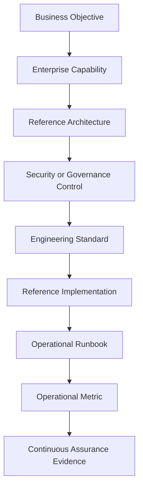

# ADR-0002 — Evolve EAODS into an Enterprise Reference Operating Model

## Context

EAODS began as an enterprise documentation suite, but its current scope now spans governance, enterprise architecture, cybersecurity, AI operations, platform engineering, resilience, operational workflows, assurance, and implementation guidance.

Continuing to treat EAODS as a collection of documents would create structural risk:

- duplicated concepts;
- inconsistent terminology;
- disconnected controls and workflows;
- limited machine readability;
- weak traceability between architecture and operations;
- reduced portfolio and commercialization value.

The Volume 10 vision establishes a stronger direction: EAODS should operate as a coherent enterprise reference platform that connects governance, design, operations, and engineering.

## Decision

EAODS shall evolve into an **Enterprise Reference Operating Model**.

All future contributions must strengthen at least one of four enduring pillars:

1. **Govern** — policy, standards, risk, compliance, ownership, and decision rights.
2. **Design** — enterprise architecture, reference models, patterns, and approved technical decisions.
3. **Operate** — service operations, SOC, SRE, platform operations, resilience, incident management, and assurance.
4. **Build** — reference implementations, automation, DevSecOps, AI agents, platform components, and engineering guidance.

EAODS Volume 10 shall serve as the principal architectural north star for operational vision, platform direction, and future program evolution.

## Required contribution model

Every major artifact should define, where applicable:

- stable identifiers;
- ownership;
- purpose and scope;
- dependencies;
- architecture relationships;
- governing controls;
- implementation guidance;
- operational workflows;
- evidence and assurance requirements;
- measurable outcomes;
- human review gates.

## Traceability model

## Consequences

### Positive

- EAODS becomes a coherent architecture and operating platform.
- Cross-volume consistency becomes an explicit engineering requirement.
- AI agents can consume structured metadata and stable relationships.
- Portfolio value shifts from technical writing toward enterprise architecture leadership.
- Future commercialization becomes more credible.

### Costs

- Existing documents will require normalization and metadata migration.
- Terminology must be governed centrally.
- Contributions will require stricter integration and review.
- Repository structure will grow beyond narrative documentation.

## Governance

Changes that materially alter the four-pillar model, canonical terminology, metadata structure, or cross-volume architecture require review by the EAODS Enterprise Architecture Board and final approval by the program owner.
