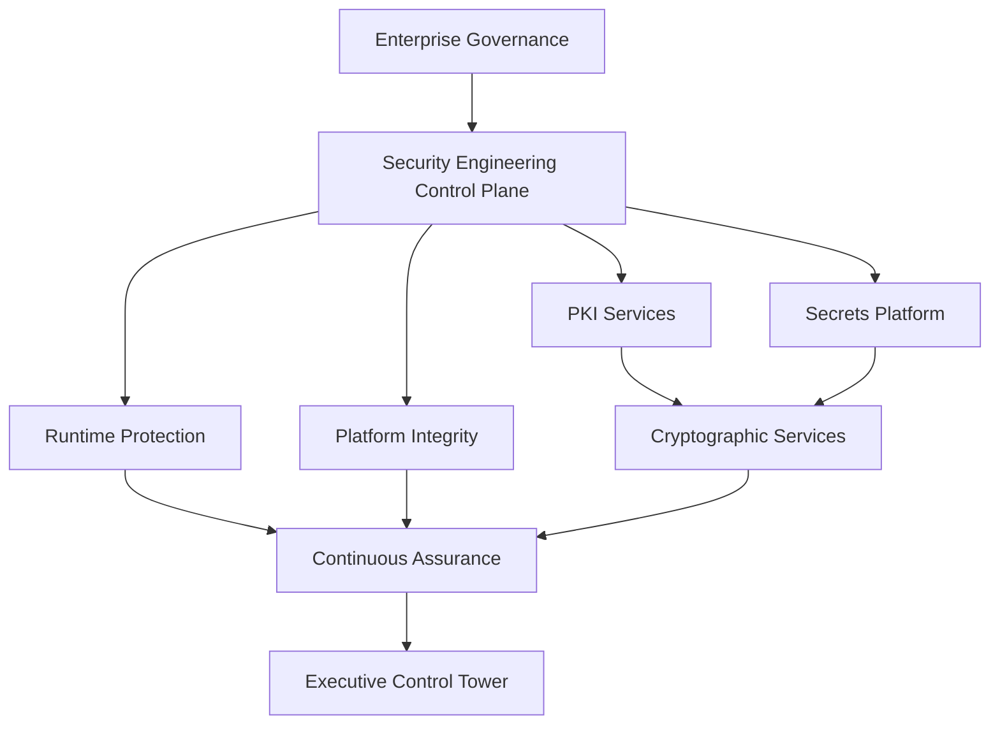
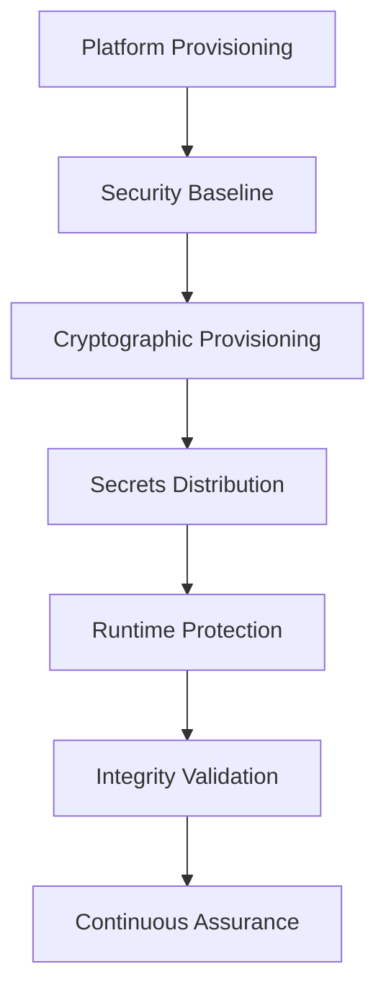

# Volume 8 — Enterprise Security Engineering

## Purpose

This volume defines the engineering architecture protecting the EAODS platform throughout its operational lifecycle.

## Architecture

## Enterprise workflow

## Integration points

- Enterprise Identity Platform
- Enterprise DevSecOps Platform
- Automation Fabric
- Enterprise Data Platform
- Enterprise Knowledge Graph
- Continuous Assurance
- Executive Control Tower
- Enterprise Cyber Command

## QA checklist

- [ ] YAML front matter validated.
- [ ] PKI and secrets ownership assigned.
- [ ] Cryptographic lifecycle documented.
- [ ] Runtime protection and hardening baselines defined.
- [ ] Integrity monitoring integrated.
- [ ] Recovery procedures tested.
- [ ] Continuous Assurance evidence registered.

## Human review gate

Enterprise approval requires review by security, technology, architecture, platform engineering, assurance, audit, cyber command, and executive governance leadership.
