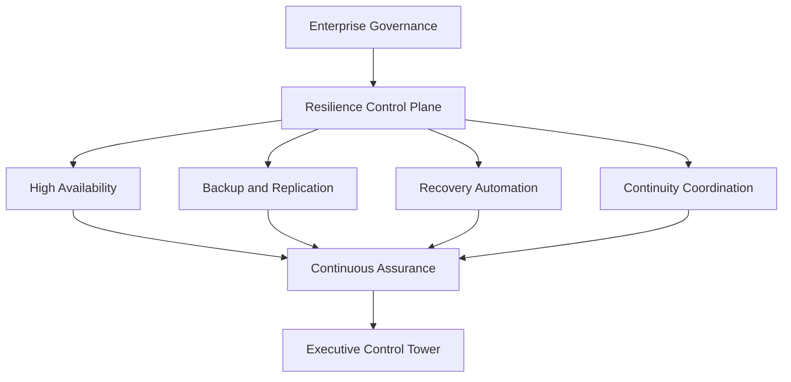
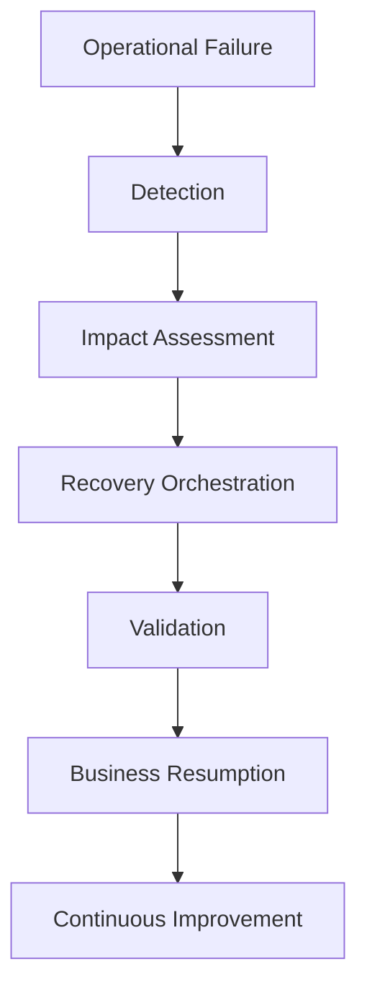

# Volume 9 — Enterprise Infrastructure Resilience, High Availability & Disaster Recovery Architecture

## Purpose

This volume establishes the canonical engineering architecture for maintaining continuous EAODS platform operation during component failures, cyber incidents, infrastructure outages, and regional disasters.

## Strategic objectives

- Eliminate avoidable single points of failure.
- Minimize operational interruption.
- Support graceful degradation.
- Accelerate controlled restoration.
- Preserve enterprise data integrity.
- Continuously validate recovery capability.

## Reference architecture



## Capability domains

| Capability | Primary responsibility |
|---|---|
| High availability | Continuous service operation |
| Backup engineering | Protected data recovery |
| Disaster recovery | Service restoration |
| Business continuity | Operational continuity |
| Dependency modeling | Failure-impact analysis |
| Chaos engineering | Controlled resilience validation |
| Recovery automation | Automated restoration |
| Resilience analytics | Operational measurement |

## Canonical resilience record

```yaml
resilience_service_id: RES-00163
service_name: EnterpriseRecoveryCoordinator
owner: PlatformEngineering
availability_target: 99.99%
rto: "30 minutes"
rpo: "5 minutes"
recovery_classification: Tier1
continuous_validation: Enabled
```

## Enterprise workflow



## Integration points

- Enterprise Data Platform
- Enterprise Identity Platform
- Automation Fabric
- Enterprise Knowledge Graph
- Continuous Assurance
- Enterprise Cyber Command
- Executive Control Tower
- Business Continuity Program

## Enterprise case study

### Scenario

A multinational financial institution experiences a regional cloud outage affecting identity, security analytics, and automation services.

### EAODS implementation

The resilience control plane redirects eligible workloads, restores critical services through governed orchestration, validates data integrity, and updates executive reporting. Continuous Assurance independently verifies recovery evidence and objective attainment.

### Outcome

Critical cyber-defense services remain operational, recovery objectives are achieved within approved thresholds, and leadership receives continuous visibility into restoration progress and residual risk.

## QA checklist

- [ ] YAML front matter validated.
- [ ] Availability tiers approved.
- [ ] Failure domains documented.
- [ ] Backup restoration tested.
- [ ] RTO and RPO values validated.
- [ ] Recovery sequencing reviewed.
- [ ] Chaos exercises authorized.
- [ ] Business continuity integration confirmed.
- [ ] Dependency maps synchronized.
- [ ] Observability requirements implemented.
- [ ] Continuous Assurance evidence registered.

## Human review gate

Enterprise approval requires review by the Chief Information Security Officer, Chief Technology Officer, Chief Information Officer, Business Continuity Director, Disaster Recovery Program Manager, Enterprise Architecture Review Board, Platform Engineering Leadership, AI Governance Council, Continuous Assurance Office, Internal Audit, Enterprise Cyber Command Director, and the Executive Governance Council.
