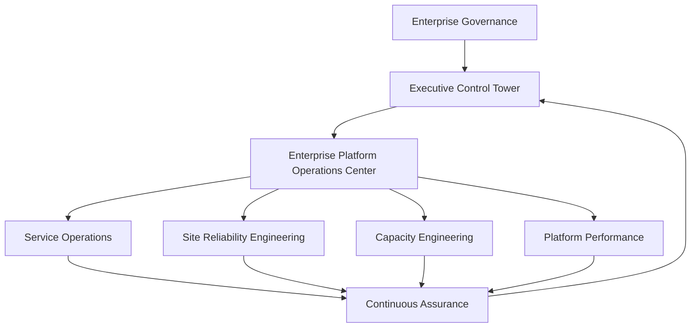
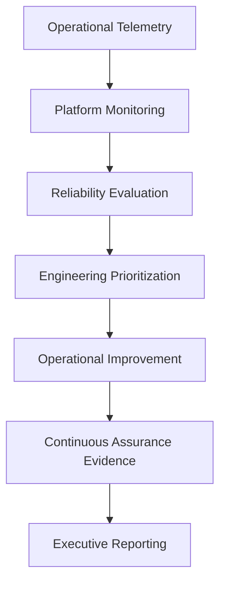

# Volume 10 — Enterprise Platform Operations Center, Site Reliability Engineering & Operational Engineering

## Purpose

This volume establishes the Enterprise Platform Operations Center (EPOC) as the operational authority for the health, reliability, performance, and continuous improvement of the EAODS platform.

Where the Enterprise Cyber Command directs cybersecurity operations, the EPOC governs the ongoing operational engineering of the platform itself — service ownership, reliability, capacity, and performance — so that governed AI-assisted operations run predictably at enterprise scale.

## Strategic objectives

- Maximize platform reliability.
- Reduce operational risk.
- Continuously improve engineering quality.
- Establish measurable service ownership.
- Optimize operational efficiency.
- Coordinate engineering response activities.
- Provide executive operational transparency.

## Engineering principles

Platform operations shall remain service-oriented, measurable, observable, automation-assisted, continuously improving, evidence-driven, resilient, and constitutionally governed. Operational decisions shall prioritize long-term platform stability over short-term convenience.

## Reference architecture



## Capability domains

| Capability | Primary responsibility |
|---|---|
| Service operations | Daily platform operations |
| Site reliability engineering | Reliability improvement |
| Capacity engineering | Growth planning |
| Platform performance | Performance optimization |
| Service ownership | Operational accountability |
| Operational analytics | Engineering metrics |
| Platform optimization | Continuous improvement |
| Operational governance | Engineering policy enforcement |

## Canonical service ownership record

```yaml
service_id: SVC-00387
service_name: AutomationFabric
service_owner: PlatformEngineering
operations_owner: EnterprisePlatformOperationsCenter
executive_sponsor: ChiefTechnologyOffice
availability_target: 99.95%
reliability_classification: Tier1
error_budget_policy: Enforced
continuous_validation: Enabled
```

## Service ownership framework

Every production service shall identify a business owner, an engineering owner, an operational owner, an executive sponsor, a recovery authority, an architecture authority, and an assurance owner. Ownership shall remain continuously documented.

## Service level framework

| Metric | Purpose |
|---|---|
| SLI | Measured operational indicator |
| SLO | Expected operational objective |
| SLA | Business commitment (where applicable) |
| Error budget | Controlled reliability risk |

Service level objectives shall be based on observed service behavior rather than aspirational targets. Exhausted error budgets shall trigger engineering review before additional production changes.

## Reliability engineering model

Reliability engineering shall focus on reducing operational toil, improving service stability, increasing automation maturity, validating resilience, optimizing recovery, and reducing incident recurrence. Reliability initiatives shall be prioritized using measurable operational data.

## Enterprise workflow



## Integration points

- Enterprise Cyber Command
- Enterprise Automation Fabric
- Enterprise Data Platform
- Enterprise Knowledge Graph
- Enterprise Identity Platform
- Continuous Assurance
- Executive Control Tower
- Business Continuity Program
- DevSecOps Platform

## Enterprise case study

### Scenario

A global retail enterprise operates AI-assisted cybersecurity services across hybrid cloud environments. Although cybersecurity detection performs well, frequent platform engineering issues, deployment instability, and unclear service ownership degrade operational reliability.

### EAODS implementation

The Enterprise Platform Operations Center centralizes service ownership, reliability engineering, operational analytics, and error-budget governance. Service level objectives are derived from observed behavior, and platform changes are gated on remaining error budget. Continuous Assurance independently verifies operational evidence.

### Outcome

Platform reliability improves, deployment stability increases, operational debt declines, and executive leadership receives continuous, authoritative visibility into service health and engineering throughput.

## QA checklist

- [ ] YAML front matter validated.
- [ ] Platform operations architecture documented.
- [ ] Operational capability domains completed.
- [ ] Canonical service ownership record defined.
- [ ] Service ownership framework documented.
- [ ] Service level framework documented.
- [ ] Error budget governance completed.
- [ ] Reliability engineering model completed.
- [ ] Enterprise workflow completed.
- [ ] Integration points documented.
- [ ] Continuous Assurance evidence registered.
- [ ] Enterprise case study completed.

## Human review gate

Enterprise approval requires review by the Chief Technology Officer, Chief Information Officer, Chief Information Security Officer, Platform Engineering Leadership, Site Reliability Engineering Leadership, Enterprise Architecture Review Board, AI Governance Council, Continuous Assurance Office, Internal Audit, Enterprise Cyber Command Director, and the Executive Governance Council.
