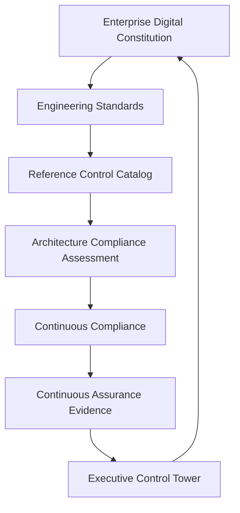
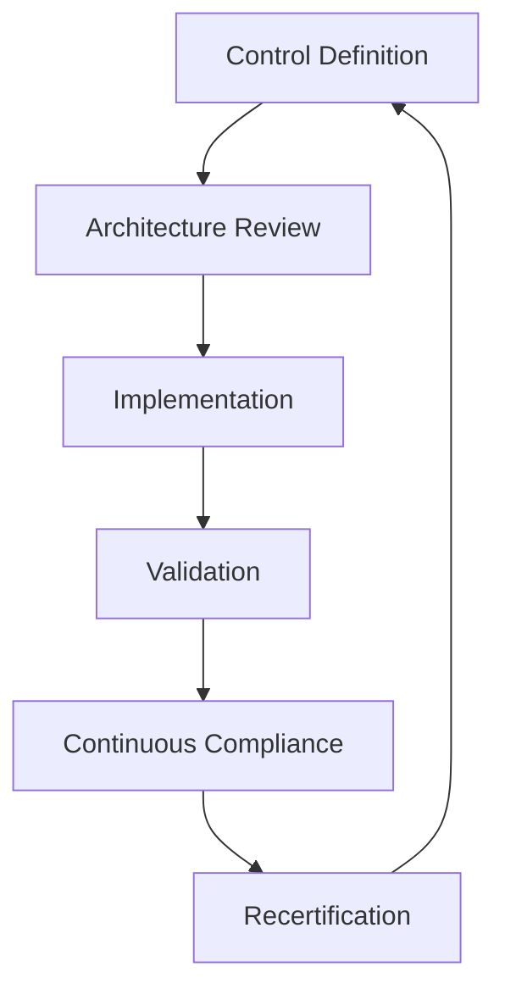
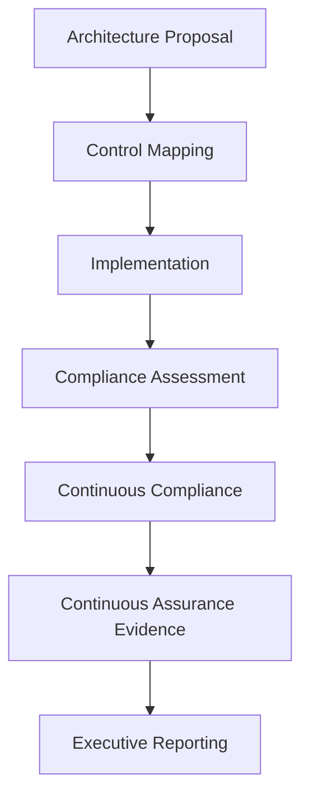

# Volume 11 — Enterprise Reference Control Catalog, Engineering Standards & Architecture Compliance Framework

## Purpose

This volume establishes the authoritative engineering control catalog governing every Domain 03 implementation, together with the architecture standards and compliance-assessment methodology that hold implementations accountable to them.

The framework ensures every platform service can demonstrate measurable compliance with EAODS engineering controls through objective evidence rather than self-attestation. It is the compliance layer that ties governance, architecture, operations, and engineering into a single traceable model.

## Strategic objectives

- Establish a canonical engineering control library.
- Standardize architecture compliance.
- Enable measurable implementation maturity.
- Improve engineering consistency.
- Strengthen continuous assurance.
- Reduce architectural drift.
- Support executive governance reporting.

## Engineering governance principles

Engineering controls shall be risk-informed, measurable, technology-neutral where practical, evidence-based, continuously validated, version-controlled, independently reviewable, and constitutionally governed. Compliance shall be determined through objective evidence rather than self-attestation.

## Reference architecture



## Engineering control domains

| Domain | Primary objective |
|---|---|
| Architecture governance | Design consistency |
| Identity and trust | Zero Trust implementation |
| Security engineering | Platform protection |
| DevSecOps | Secure software delivery |
| Data engineering | Trusted operational data |
| Automation | Governed AI execution |
| Observability | Operational visibility |
| Resilience | Availability and recovery |
| Operations | Reliability engineering |
| Assurance | Independent validation |

Each control domain shall maintain an assigned governance owner.

## Canonical engineering control

```yaml
control_id: EAODS-CTRL-000184
control_name: Service Identity Verification
control_domain: Identity
control_classification: Preventive
constitutional_authority: "Volume 1 — Enterprise Digital Constitution"
architecture_reference: "EAODS v17.3 Volume 8 — Security Engineering"
objective: "Every production service authenticates with a verifiable, scoped identity."
implementation_guidance: "Issue short-lived, scoped credentials; verify on each privileged call; fail closed."
evidence_requirement: "Identity issuance and verification logs registered with Continuous Assurance."
owner: PlatformSecurity
maturity_target: Level4
```

## Control classification model

Engineering controls shall be classified as Preventive, Detective, Corrective, Compensating, or Directive. Multiple classifications may apply where justified.

## Control lifecycle



## Engineering standards hierarchy

The standards hierarchy shall consist of Constitutional Principles, Enterprise Policies, Architecture Standards, Engineering Standards, Platform Standards, Implementation Guidelines, and Operational Procedures. Lower-level standards shall not conflict with higher-level governance.

## Architecture review framework

Every architecture review shall evaluate constitutional alignment, engineering-standards compliance, security implications, operational impact, scalability, observability, resilience, and maintainability. Architecture decisions shall be preserved as Architecture Decision Records (ADRs).

## Compliance assessment methodology

Compliance evaluations shall examine control implementation, operational evidence, configuration state, automation validation, engineering documentation, runtime observations, and audit findings. Assessments shall produce repeatable results under equivalent conditions.

## Engineering maturity model

| Level | Description |
|---|---|
| Level 1 | Initial |
| Level 2 | Managed |
| Level 3 | Defined |
| Level 4 | Measured |
| Level 5 | Optimizing |

Each engineering capability shall maintain an assigned maturity rating and improvement roadmap.

## Control traceability matrix

Every engineering control shall trace to constitutional authority, architecture domain, platform capability, implemented service, validation evidence, operational metrics, and a responsible owner. Traceability shall remain machine-readable where feasible.

## Architecture exception governance

Approved exceptions shall document business justification, associated risks, compensating controls, an expiration date, the approving authority, and a remediation plan. Expired exceptions shall trigger mandatory review.

## Continuous compliance

Continuous compliance services shall monitor configuration drift, architecture deviations, failed validations, policy violations, control health, and engineering debt. Material deviations shall initiate corrective engineering workflows.

## Enterprise workflow



## Integration points

- Enterprise Digital Constitution
- Enterprise Identity Platform
- Enterprise Security Engineering Platform
- Enterprise DevSecOps Platform
- Enterprise Data Platform
- Automation Fabric
- Enterprise Knowledge Graph
- Continuous Assurance
- Executive Control Tower
- Enterprise Cyber Command

## Enterprise case study

### Scenario

A multinational manufacturing enterprise expands its AI-assisted cyber operations across multiple business units. Independent engineering teams implement services with inconsistent security controls, documentation, and architecture patterns.

### EAODS implementation

The Enterprise Reference Control Catalog standardizes mandatory engineering controls, architecture review, and evidence-based compliance assessment. Controls trace to constitutional authority and to the services that implement them, and continuous compliance monitors for architectural drift.

### Outcome

Engineering consistency improves, architecture deviations decline, compliance reporting becomes evidence-driven, and executive leadership gains a defensible, traceable view of engineering conformance across the enterprise.

## QA checklist

- [ ] YAML front matter validated.
- [ ] Engineering control architecture documented.
- [ ] Control domains completed.
- [ ] Canonical engineering control defined.
- [ ] Control classification model documented.
- [ ] Control lifecycle completed.
- [ ] Engineering standards hierarchy documented.
- [ ] Architecture review framework completed.
- [ ] Compliance assessment methodology documented.
- [ ] Engineering maturity model completed.
- [ ] Control traceability matrix documented.
- [ ] Architecture exception governance completed.
- [ ] Continuous compliance documented.
- [ ] Integration points documented.
- [ ] Enterprise case study completed.

## Human review gate

Enterprise approval requires review by the Chief Technology Officer, Chief Information Security Officer, Chief Information Officer, Enterprise Architecture Review Board, Platform Engineering Leadership, Security Engineering Leadership, DevSecOps Leadership, AI Governance Council, Continuous Assurance Office, Internal Audit, Enterprise Cyber Command Director, and the Executive Governance Council.
