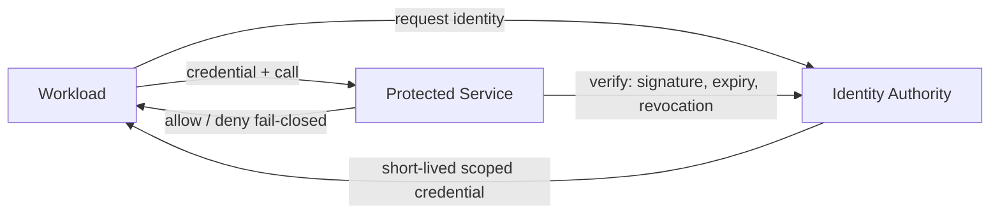

# PAT-0001 — Zero Trust Service Identity

**Domain:** Identity and trust · **Status:** Approved · **Source:** EAODS v17.3 Volume 8 (Security Engineering), Volume 11

## Context

Platform services, automation workloads, and AI agents call one another and privileged resources across trust boundaries. Ambient or long-lived credentials make any single compromise transitive.

## Problem

How does a caller prove who it is on every privileged call, such that trust is never ambient, never permanent, and revocable without redeployment?

## Solution

Issue every workload a short-lived, scoped, verifiable identity from a central identity authority. Verify the credential on each privileged call — signature, expiry, revocation — and fail closed on any ambiguity. Scopes are allow-listed per role; delegation is off by default.

## Structure

## Consequences

- Compromise blast radius is bounded by scope and credential lifetime.
- Revocation is immediate and central; no credential rotation fire drills.
- Adds an issuance/verification dependency: the identity authority becomes Tier 1 and must itself follow PAT-0004 for recovery.

## Governing controls

- EAODS-CTRL-000184 — Service Identity Verification (Preventive)

## Related objects

- TERM-0006 Automation Fabric · Volume 11 control lifecycle · PAT-0003 (verification events feed evidence)
