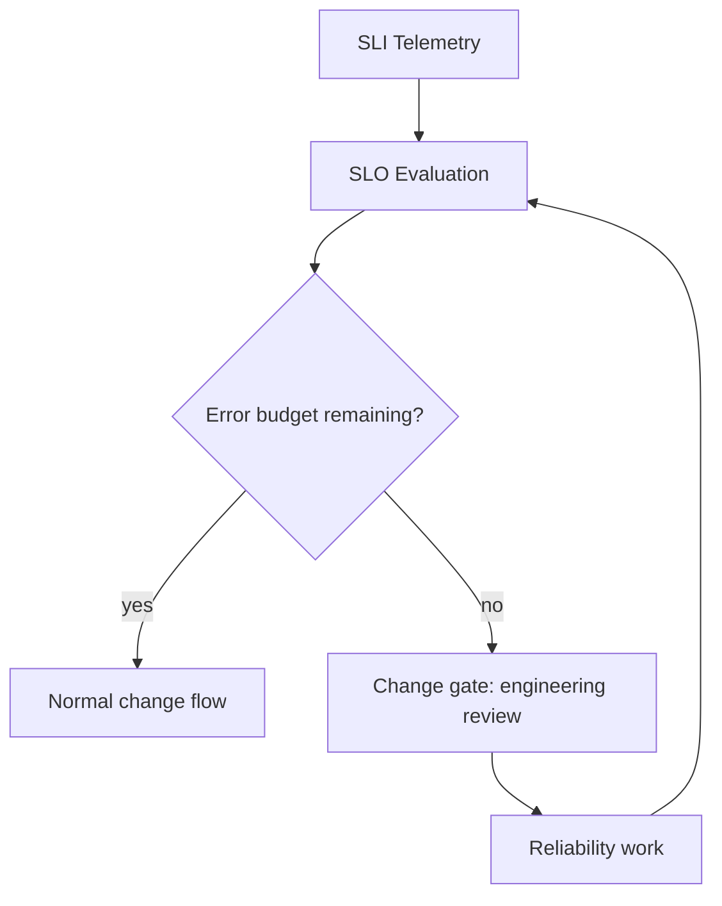

# PAT-0002 — Error-Budget-Gated Delivery

**Domain:** Operations · **Status:** Approved · **Source:** EAODS v17.3 Volume 10 (Platform Operations Center & SRE)

## Context

Delivery pressure and reliability pull in opposite directions. Without an objective arbiter, release pace is negotiated ad hoc and reliability erodes silently.

## Problem

How do teams decide, without escalation battles, when to ship and when to stop shipping and stabilize?

## Solution

Define SLOs from observed service behavior and derive an error budget per service. While budget remains, changes flow normally. When a budget is exhausted, further production change for that service is gated on engineering review until reliability work restores headroom. The gate is policy, not judgment — enforced in the delivery pipeline.

## Structure

## Consequences

- Reliability disputes become arithmetic instead of negotiation.
- Requires trustworthy SLI telemetry and honest SLOs based on observed behavior, not aspiration.
- A gamed or stale SLO silently disables the gate — SLOs must be reviewed on the Volume 10 cycle.

## Governing controls

- Volume 10 error-budget policy (`error_budget_policy: Enforced` on the canonical service record)

## Related objects

- TERM-0003 Enterprise Platform Operations Center · TERM-0009 Error budget · SVC-00387 (reference service record)
