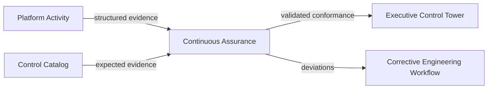

# PAT-0003 — Continuous Assurance Evidence Pipeline

**Domain:** Assurance · **Status:** Approved · **Source:** EAODS v17.3 Volumes 9–11

## Context

Compliance and reliability claims are only as good as their evidence. Self-attestation drifts from reality, and point-in-time audits observe a system that has already changed.

## Problem

How does the enterprise continuously demonstrate — to executives, auditors, and itself — that controls are implemented and objectives are met, using evidence rather than assertion?

## Solution

Every governed activity (identity verification, recovery exercise, deployment, compliance check) emits structured evidence records to an independent Continuous Assurance function as a side effect of running — not as a separate reporting step. Assurance validates evidence against registered controls and objectives, and the Executive Control Tower reports only from validated evidence.

## Structure

## Consequences

- Compliance reporting becomes a by-product of operations rather than a quarterly project.
- Evidence requirements must be defined per control (Volume 11 `evidence_requirement`) or the pipeline validates nothing.
- Assurance must remain independent: it consumes evidence but is never the system that produces it.

## Governing controls

- Volume 11 compliance assessment methodology (evidence over self-attestation)

## Related objects

- TERM-0004 Continuous Assurance · TERM-0005 Executive Control Tower · EAODS-CTRL-000184 (`evidence_requirement`)
