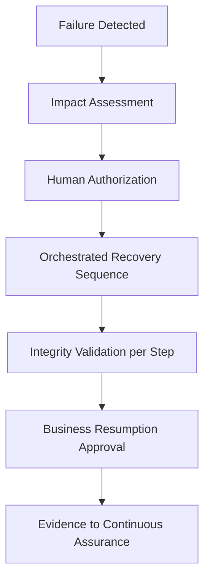

# PAT-0004 — Governed Recovery Orchestration

**Domain:** Resilience · **Status:** Approved · **Source:** EAODS v17.3 Volume 9 (Infrastructure Resilience, HA & DR)

## Context

During an outage, ad-hoc recovery improvisation is the second disaster: undocumented restore order, dependency surprises, and unverified data integrity extend downtime and can corrupt state.

## Problem

How is recovery executed fast enough to meet RTO/RPO targets while remaining controlled, verifiable, and safe to re-run?

## Solution

Recovery runs through a resilience control plane that owns dependency maps, restoration sequencing, and validation. Recovery actions are automated and idempotent; each step validates integrity before the next proceeds; and evidence of objective attainment (RTO/RPO) is emitted to Continuous Assurance (PAT-0003). Humans authorize entry into recovery and business resumption — the steps in between are orchestrated, not improvised.

## Structure

## Consequences

- Recovery meets objectives repeatably; re-running a step cannot corrupt state.
- Requires continuously synchronized dependency maps — stale maps sequence the restore wrong.
- Chaos exercises (Volume 9) are the only honest test of this pattern; untested recovery automation is a liability, not an asset.

## Governing controls

- Volume 9 recovery classification and continuous validation (`RES-` records)

## Related objects

- RES-00163 (reference resilience record) · PAT-0003 evidence pipeline · TERM-0004 Continuous Assurance
