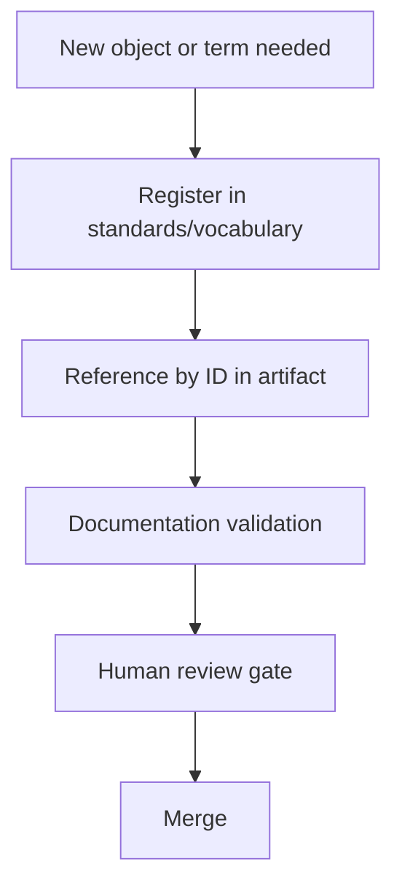

# STD-0001 — Canonical Terminology & Object Identifier Standard

## Purpose

This standard establishes centrally governed terminology and stable object identifiers across all EAODS artifacts, as required by ADR-0002. It converts the suite from narrative documents into a referenceable object model: every normative concept has one canonical name, and every governed object has one stable identifier that other artifacts can cite.

## Scope

Applies to all framework volumes, standards, ADRs, and future libraries (threat models, runbooks, architecture patterns) in this repository.

## Authoritative registries

| Registry | Location | Contents |
|---|---|---|
| Object identifiers | `standards/vocabulary/object-identifiers.yaml` | Registered ID prefixes, formats, owners |
| Canonical terms | `standards/vocabulary/canonical-terms.yaml` | Canonical vocabulary with definitions and aliases |

The registries are the source of truth. Prose in any volume that conflicts with a registry entry is a defect in the volume.

## Identifier rules

1. **Format.** `<PREFIX>-<zero-padded integer>` matching `^[A-Z][A-Z0-9-]*-[0-9]{4,6}$`.
2. **Registration before use.** A prefix must exist in the identifier registry before any artifact mints an ID with it.
3. **Stability.** Published identifiers are never reused, renumbered, or reassigned. Retired objects keep their identifier with a retired status.
4. **One object, one ID.** An object carries the same identifier across every volume, diagram, and record that references it.
5. **Fixed width per prefix.** Zero-padding width is fixed when the prefix is registered; new prefixes use six digits.

### Registered prefixes

| Prefix | Object type | Defined in | Owner |
|---|---|---|---|
| `EAODS-CTRL` | Engineering control | Volume 11 | Engineering Governance |
| `SVC` | Platform service | Volume 10 | Enterprise Platform Operations Center |
| `RES` | Resilience service record | Volume 9 | Platform Engineering |
| `ADR` | Architecture decision record | `architecture/adr/` | Enterprise Architecture Review Board |
| `STD` | Enterprise standard | `docs/standards/` | Engineering Governance |
| `TERM` | Canonical vocabulary term | Canonical terms registry | Engineering Governance |

Prefixes `THR` (threat models), `RUN` (runbooks), and `PAT` (architecture patterns) are reserved for the roadmap libraries and must not be used until those libraries are established.

## Terminology rules

1. **One canonical name per concept.** Aliases are listed in the registry and used only when quoting or providing continuity with earlier material.
2. **Registration before normative use.** A term used normatively in a framework volume must exist in the canonical terms registry.
3. **No silent redefinition.** Changing a definition requires Engineering Governance review and a registry version increment.
4. **Definitions travel with the registry.** Volumes may restate a definition for readability but must not contradict the registry.

## Contribution workflow

A pull request that introduces an unregistered identifier prefix or an unregistered normative term shall not pass review.

## Integration points

- Volume 11 control traceability matrix (controls cite `SVC`/`RES` objects by ID)
- Architecture Decision Records (`ADR` prefix)
- Continuous Assurance evidence (evidence records cite object IDs)
- Future knowledge-graph metadata (registries provide node identity)

## QA checklist

- [ ] Identifier registry present and parseable.
- [ ] Canonical terms registry present and parseable.
- [ ] All existing volume identifiers registered.
- [ ] Reserved prefixes documented for roadmap libraries.
- [ ] Contribution workflow documented.
- [ ] Human review gate completed.

## Human review gate

Changes to this standard or to either registry require review by the Enterprise Architecture Review Board and final approval by the program owner, per GOVERNANCE.md and ADR-0002.
