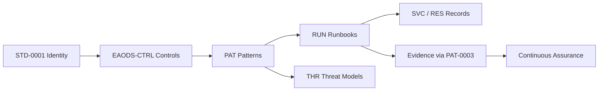

# STD-0002 — Cross-Artifact Traceability & Knowledge-Graph Metadata

## Purpose

This standard completes the ADR-0002 traceability model: every governed EAODS object is a node, every stated relationship between objects is a registered, validated edge, and the whole graph is machine-readable and CI-enforced. Traceability stops being a documentation convention and becomes a checked property of the repository.

## Scope

All artifacts under `docs/` and `architecture/`, the registries under `standards/vocabulary/`, and the relationship graph under `standards/graph/`.

## Authoritative sources

| Source | Location | Role |
|---|---|---|
| Identifier registry | `standards/vocabulary/object-identifiers.yaml` | Node identity (STD-0001) |
| Canonical terms | `standards/vocabulary/canonical-terms.yaml` | Term nodes (STD-0001) |
| Relationship graph | `standards/graph/relationships.yaml` | Directed, typed edges between objects |
| Validator | `scripts/validate_traceability.py` | CI enforcement |

## Graph model

Nodes are stable identifiers (`EAODS-CTRL-`, `SVC-`, `RES-`, `PAT-`, `RUN-`, `THR-`, `STD-`, `TERM-`, `ADR-`). Edges are directed and typed:

| Edge type | Meaning |
|---|---|
| `implements` | Subject realizes the control or standard named by object |
| `operationalizes` | Subject is the executable procedure for the pattern or policy named by object |
| `mitigates` | Subject reduces the threat named by object |
| `applies_to` | Subject governs or acts upon the service or record named by object |
| `emits_evidence_to` | Subject produces assurance evidence consumed under object |
| `governed_by` | Subject is subordinate to the standard or decision named by object |

New edge types require Engineering Governance review before use.

## Enforced rules

1. **No unregistered identifiers.** Any identifier-shaped token cited in an artifact must use a prefix registered under STD-0001. An unregistered prefix fails CI.
2. **No dangling edges.** Every graph edge endpoint must exist — cited in at least one artifact or present in a registry. A dangling endpoint fails CI.
3. **No unregistered edge types.** Edges use only the types declared in the graph file.
4. **Graph follows prose.** An edge is added when an artifact states the relationship; the graph records what the documents claim, and validation keeps the two from drifting.

## Validation

```bash
python scripts/validate_traceability.py
```

Runs in the Documentation Quality workflow alongside front-matter validation and the strict build. A pull request that cites an unknown identifier or leaves a dangling relationship does not merge.

## Traceability chain realized

The ADR-0002 target chain is now navigable end to end by following typed edges:



## QA checklist

- [ ] Relationship graph present and parseable.
- [ ] Edge-type vocabulary documented.
- [ ] Validator enforced in CI.
- [ ] All existing artifacts pass validation.
- [ ] Human review gate completed.

## Human review gate

Changes to the edge-type vocabulary, the graph file structure, or the validator's rules require review by the Enterprise Architecture Review Board and final approval by the program owner, per GOVERNANCE.md and ADR-0002.
